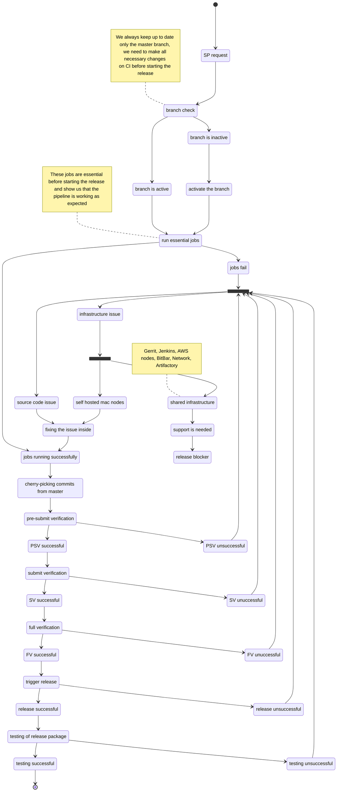

# Special Release Workflow

```mermaid
stateDiagram-v2
  state join_state <<join>>
  state fork_state <<fork>>
  SP: SP request
  BC: branch check
  BA: branch is active
  BI: branch is inactive
  REJ: run essential jobs
  ABJ: activate the branch
  JS: jobs running successfully
  JUS: jobs fail
  SI: source code issue
  II: infrastructure issue 
  CCI: shared infrastructure
  Mac: self hosted mac nodes
  Fixing: fixing the issue inside
  Support: support is needed
  Blocker: release blocker
  Cherry_pick: cherry-picking commits from master
  PSV: pre-submit verification
  PSV_Success: PSV successful
  PSV_Unsuccess: PSV unsuccessful
  SV: submit verification
  SV_Success: SV successful
  SV_Unsuccess: SV unuccessful
  FV: full verification
  FV_Success: FV successful
  FV_Unsuccess: FV unuccessful
  Release: trigger release
  Release_Success: release successful
  Release_Unsuccess: release unsuccessful
  Testing: testing of release package
  Testing_Success: testing successful
  Testing_Unsuccess: testing unsuccessful
  
  
  note left of BC
     We always keep up to date only the master branch, 
     we need to make all necessary changes 
     on CI before starting the release
  end note

  note left of REJ
     These jobs are essential before starting the release 
     and show us that the pipeline is working as expected
  end note
  
  note left of CCI
      Gerrit, Jenkins, AWS nodes, BitBar, Network, Artifactory
  end note

[*] --> SP
SP --> BC
BC --> BA
BC --> BI
BA --> REJ
BI --> ABJ
ABJ --> REJ
REJ --> JS
REJ --> JUS
JUS --> join_state
II --> fork_state
fork_state --> Mac
fork_state --> CCI
SI --> Fixing
Mac --> Fixing
Fixing --> JS
CCI --> Support
Support --> Blocker
JS --> Cherry_pick
Cherry_pick --> PSV
PSV --> PSV_Success
PSV --> PSV_Unsuccess
PSV_Unsuccess --> join_state
PSV_Success --> SV
SV --> SV_Success
SV --> SV_Unsuccess
SV_Unsuccess --> join_state
SV_Success --> FV
FV --> FV_Success
FV --> FV_Unsuccess
FV_Unsuccess --> join_state
join_state --> SI
join_state --> II
FV_Success --> Release
Release --> Release_Success
Release --> Release_Unsuccess
Release_Unsuccess --> join_state
Release_Success --> Testing
Testing --> Testing_Success
Testing --> Testing_Unsuccess
Testing_Unsuccess --> join_state
Testing_Success --> [*]
```
