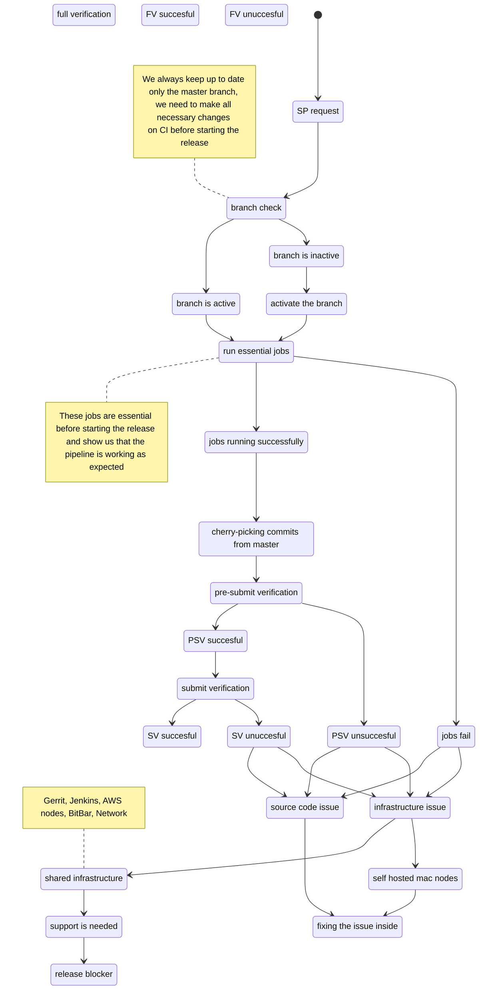

# Special Release Workflow

```mermaid
stateDiagram-v2
  SP: SP request
  BC: branch check
  BA: branch is active
  BI: branch is inactive
  REJ: run essential jobs
  ABJ: activate the branch
  JS: jobs running successfully
  JUS: jobs fail
  SI: source code issue
  II: infrastructure issue
  CCI: shared infrastructure
  Mac: self hosted mac nodes
  Fixing: fixing the issue inside
  Support: support is needed
  Blocker: release blocker
  Cherry_pick: cherry-picking commits from master
  PSV: pre-submit verification
  PSV_Success: PSV succesful
  PSV_Unsuccess: PSV unsuccesful
  SV: submit verification
  SV_Success: SV succesful
  SV_Unsuccess: SV unuccesful
  FV: full verification
  FV_Success: FV succesful
  FV_Unsuccess: FV unuccesful
  
  
  note left of BC
     We always keep up to date only the master branch, 
     we need to make all necessary changes 
     on CI before starting the release
  end note

  note right of REJ
     These jobs are essential before starting the release 
     and show us that the pipeline is working as expected
  end note
  
  note left of CCI
      Gerrit, Jenkins, AWS nodes, BitBar, Network
  end note

[*] --> SP
SP --> BC
BC --> BA
BC --> BI
BA --> REJ
BI --> ABJ
ABJ --> REJ
REJ --> JS
REJ --> JUS
JUS --> SI
JUS --> II
II --> CCI
II --> Mac
SI --> Fixing
Mac --> Fixing
CCI --> Support
Support --> Blocker
JS --> Cherry_pick
Cherry_pick --> PSV
PSV --> PSV_Success
PSV --> PSV_Unsuccess
PSV_Unsuccess --> SI
PSV_Unsuccess --> II
PSV_Success --> SV
SV --> SV_Success
SV --> SV_Unsuccess
SV_Unsuccess --> SI
SV_Unsuccess --> II

```
